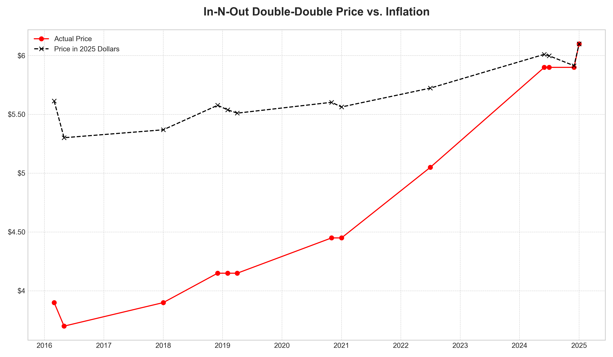
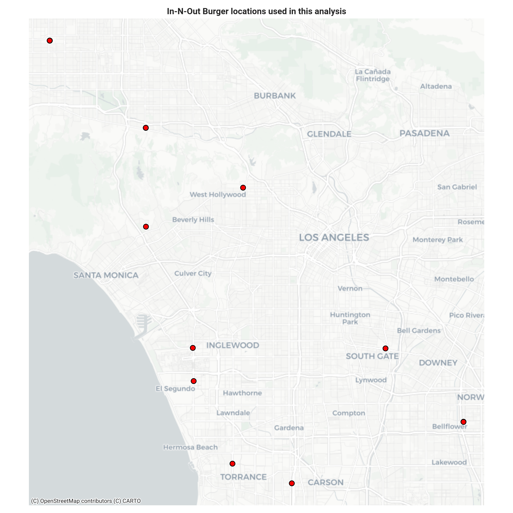

# In-N-Out Burger inflation tracker

This project uses OpenAI's GPT-4o model to analyze screenshots of In-N-Out drive-thru menus from Google Street View. It extracts menu item prices, calorie counts and the date and location of the photo, compiling the data into a single JSON file. This allows for tracking menu price inflation over time.

## Key findings

> The graph tells a story of a long period where the Double-Double was a famously good deal, followed by a recent and sharp correction where its price is now rising faster than the average cost of eating out.



## Data source

This project combines two key data sources:
- **Menu prices**: Sourced from historical Google Street View imagery of In-N-Out drive-thru menus. The image quality varies depending on the generation of the Street View camera and the angle of the shot. As a result, some menu items are occasionally listed as `null` where the model could not confidently extract a price.
- **Inflation data**: The analysis uses the Consumer Price Index (CPI) for "Food Away From Home" (Series ID `CUUR0000SEFV`), sourced directly from the US Bureau of Labor Statistics. This is used because it provides a more accurate benchmark for restaurant price inflation than the general, all-items CPI.

*Analysis inspired by [ShoPhoCho's post on TikTok](https://www.tiktok.com/@shophocho/video/7507878402473446698)*.

## Geographic scope

All data was collected from In-N-Out locations in the greater Los Angeles area. The map below shows the specific restaurant locations included in this analysis.



## How it works

The script in `scripts/extract_menu_data.py` processes each image in the `images/` folder. For each image, it sends a request to the GPT-4o vision model with a prompt asking for specific information:

-   Date (month and year) from the Google Street View UI.
-   GPS coordinates (latitude and longitude) if visible in the URL.
-   Prices and calorie counts for key menu items.

The model returns a JSON object with the extracted data which is then flattened and collected. The final output is saved to `data/menu_inflation.json`.

## Setup

1.  **Install dependencies**

    Make sure Python is installed. Then, install the required packages.

    ```bash
    pip install -r requirements.txt
    ```

2.  **Set up environment variables**

    The script requires API keys for OpenAI and the Bureau of Labor Statistics (BLS). Create a `.env` file in the root of the project and add the keys. You can get a free BLS key from their [website](https://data.bls.gov/registrationEngine/).

    ```
    OPENAI_API_KEY="your-openai-api-key-here"
    BLS_API_KEY="your-bls-api-key-here"
    ```

## Usage

### 1. Extract data from images

First, place screenshots of In-N-Out menus from Google Street View into the `images/` directory.

Then, execute the extraction script from the project root.

```bash
python scripts/extract_menu_data.py
```

The script will process each image and save the results to `data/menu_inflation.json`.

### 2. Analyze price changes

Once you have generated the data file, you can run the analysis script. This script fetches the latest inflation data from the BLS, compares item prices over time, and generates charts in the `plots/` directory.

```bash
python scripts/analyze_price_changes.py
```

The script will output a clear takeaway, explaining how the item's price has changed relative to inflation. You can configure the item and dates directly in the script.

## Project structure

```
.
├── data/
│   └── menu_inflation.json       # Output file with extracted data
├── images/
│   └── ...                       # Input images of menus
├── plots/
│   ├── doubledouble_price_vs_inflation.png # Output chart
│   ├── locations_map.png         # Location map
│   └── ...                       # Other generated plots
├── scripts/
│   ├── extract_menu_data.py      # Main data extraction script
│   └── analyze_price_changes.py  # Price analysis script
├── .env                          # Environment variables (needs to be created)
└── requirements.txt              # Python package dependencies
``` 